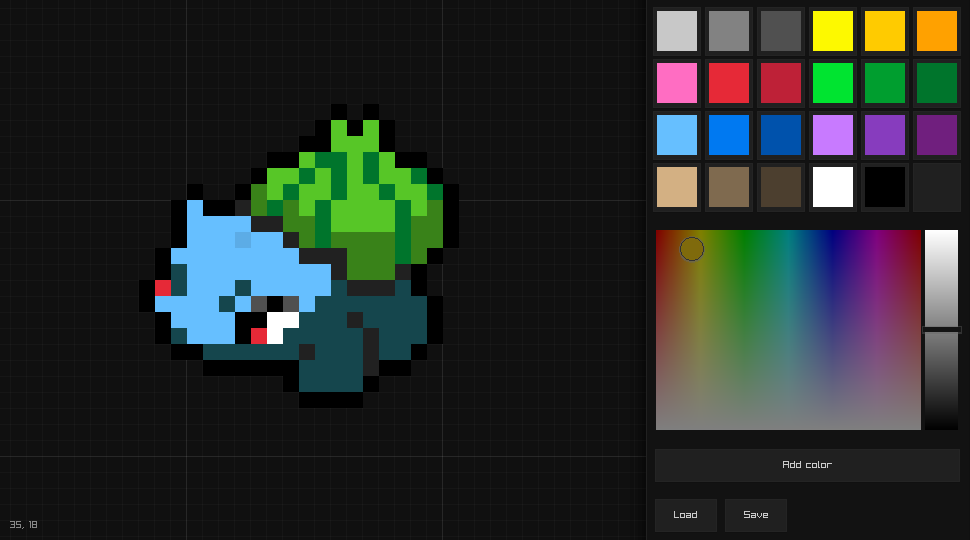

```
compfy paint

a pixel art tool with infinite canvas.
```



```
this is a just for fun project. but i want to make a decent pixel art
tool that will be nice to use, doesn't rely on too many dependencies
(aside from C standard library it currently only depends on raylib). 
it doesn't use STL and won't use exceptions. it might be a little heavy-ish
because I didn't optimize the program yet. You also can't yet put more 
than 64k pixels, and I don't use chunk system yet, but it's to be fixed easily

of course this project is done by an armateur like me so it has some
bad things, but I am refactoring in process.

this initially started as a tilemap tool but eventually grew into
the pixel art tool idea because i think it's just more fun. that's why
there's some legacy weird stuff, like "tilemap" "tileset" etc...

the demo (as of Nov 7th, 2021) was made in 1-2 weeks so its not perfect.


```

